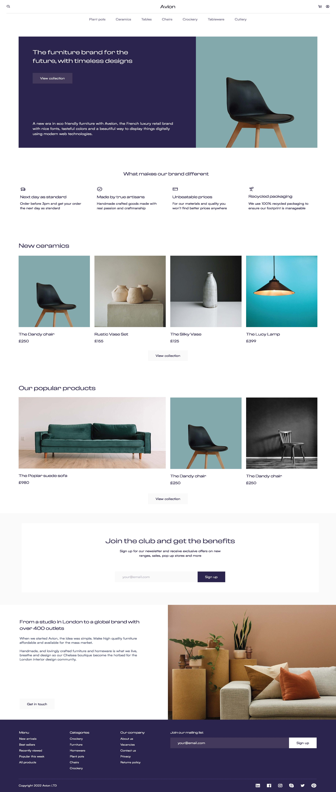

# Учебный проект вёрски статичной страницы
## О проекте
Этот репозиторий содержит работу по разработке и созданию статичной учебной страницы абстрактного веб-сайта.

## Задача
В рамках данной работы были поставлены следующие задачи:
- Освоить работу с Git и GitHub
- Освоить принципы семантической HTML-разметки
- Освоить принципы организации CSS-кода
- Освоить применение Flexbox для одномерного, Grid для двумерного размещения элементов и медиазапросов для создания адаптивных интерфейсов
- Освоить принципы проектирования мобильных интерфейсов с учетом гайдлайнов
## Релизация
Для верски данной страницы был использован следующий заранее предоставленный в рамках практик макет:

Был создан репозиторий и инициализарована необходимая структура папок. Подключён GitHub Pages.
После создания корректной структуры веб-страницы на основе готового макета, в качестве методологии организации CSS был выбран [БЭМ](https://ru.bem.info/methodology/css/), поскольку он больше соответствует учебным целям и лёгок в использовании. Гайдлай был выбран [Google MD (Material Design)](https://m3.material.io/)

В результате работы с CSS, кроме размещения элементов, реализованы следующие моменты:
- Микро-анимации для интерактивных элементов
- Плавная прокрутка к якорным ссылкам
- Адаптивность вёрстки под основные breakpoint'ы

Далее, проведя работу с JS, были выполнены следующие дополнения:
- Гамбургер-меню для мобильных устройств
- Кнопка прокрутки в начало страницы
## Используемые технологии
- HTML5
- CSS
- JS
## Иные инструменты
- [Типограф](https://www.artlebedev.ru/typograf/)
- [Validator W3C](https://validator.w3.org/)
- [РыбаТекст](https://fish-text.ru/)
## Ссылки
- [Публичная страница проекта на GitHub Pages](https://dal1ner.github.io/Educational_Frontend_layout/)

